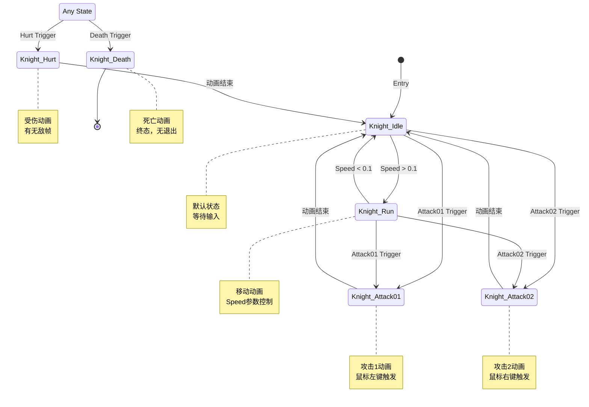

# Knight Animator Controller 状态机图

## Mermaid流程图



---

## 参数配置表

| 参数名 | 类型 | 默认值 | 用途 |
|--------|------|--------|------|
| Speed | Float | 0 | 控制移动动画（0=Idle, >0.1=Run）|
| Attack01 | Trigger | - | 触发攻击1动画 |
| Attack02 | Trigger | - | 触发攻击2动画 |
| Death | Trigger | - | 触发死亡动画 |
| Hurt | Trigger | - | 触发受伤动画 |

---

## 状态列表

### 1. Knight_Idle（空闲状态）
- **位置**: (0, 100)
- **默认状态**: ✅
- **动画**: Knight_Idle.anim
- **转换**:
  - → Knight_Run (条件: Speed > 0.1)
  - → Knight_Attack01 (条件: Attack01触发)
  - → Knight_Attack02 (条件: Attack02触发)

### 2. Knight_Run（跑步状态）
- **位置**: (340, 100)
- **动画**: Knight_Run.anim
- **转换**:
  - → Knight_Idle (条件: Speed < 0.1)
  - → Knight_Attack01 (条件: Attack01触发)
  - → Knight_Attack02 (条件: Attack02触发)

### 3. Knight_Attack01（攻击1状态）
- **位置**: (340, -200)
- **动画**: Knight_Attack01.anim
- **转换**:
  - → Knight_Idle (条件: 无，动画结束自动返回)

### 4. Knight_Attack02（攻击2状态）
- **位置**: (350, -110)
- **动画**: Knight_Attack02.anim
- **转换**:
  - → Knight_Idle (条件: 无，动画结束自动返回)

### 5. Knight_Hurt（受伤状态）
- **位置**: (-200, 230)
- **动画**: Knight_Hurt.anim
- **转换**:
  - → Knight_Idle (条件: 无，动画结束自动返回)
- **特殊**: 从Any State触发

### 6. Knight_Death（死亡状态）
- **位置**: (-200, 310)
- **动画**: Knight_Death.anim
- **转换**: 无（终态）
- **特殊**: 从Any State触发

---

## 转换详情

### 普通转换（Normal Transitions）

#### Idle → Run
- **条件**: Speed > 0.1
- **过渡时间**: 0秒
- **Exit Time**: 无
- **固定时长**: 是

#### Run → Idle
- **条件**: Speed < 0.1
- **过渡时间**: 0.25秒
- **Exit Time**: 无
- **固定时长**: 是

#### Idle/Run → Attack01
- **条件**: Attack01触发
- **过渡时间**: 0秒
- **Exit Time**: 无
- **固定时长**: 是

#### Idle/Run → Attack02
- **条件**: Attack02触发
- **过渡时间**: 0秒
- **Exit Time**: 无
- **固定时长**: 是

#### Attack01/Attack02 → Idle
- **条件**: 无
- **过渡时间**: 0秒
- **Exit Time**: 有（动画结束）
- **固定时长**: 是

#### Hurt → Idle
- **条件**: 无
- **过渡时间**: 0秒
- **Exit Time**: 有（动画结束）
- **固定时长**: 是

### Any State转换（Any State Transitions）

#### Any State → Death
- **条件**: Death触发
- **过渡时间**: 0秒
- **Exit Time**: 0.75
- **优先级**: 最高

#### Any State → Hurt
- **条件**: Hurt触发
- **过渡时间**: 0秒
- **Exit Time**: 0.75
- **优先级**: 高

---

## 可视化布局

```
        Any State (-460, 270)
           ├─→ Death Trigger → Knight_Death (-200, 310)
           └─→ Hurt Trigger → Knight_Hurt (-200, 230)
                                    ↓
                            Knight_Idle (0, 100) [Default]
                            ↙     ↓     ↘
                    Speed>0.1  Attack01  Attack02
                        ↓         ↓         ↓
              Knight_Run    Knight_Attack01  Knight_Attack02
              (340,100)     (340,-200)       (350,-110)
                  ↓              ↓              ↓
              Speed<0.1      结束动画        结束动画
                  ↓              ↓              ↓
              Knight_Idle ←──────┴──────────────┘
```

---

## 使用说明

### 代码中设置参数

```csharp
// 获取Animator组件
Animator animator = GetComponent<Animator>();

// 设置Speed参数（Float）
animator.SetFloat("Speed", moveVector.magnitude);

// 触发攻击1（Trigger）
animator.SetTrigger("Attack01");

// 触发攻击2（Trigger）
animator.SetTrigger("Attack02");

// 触发受伤（Trigger）
animator.SetTrigger("Hurt");

// 触发死亡（Trigger）
animator.SetTrigger("Death");
```

### 状态机工作流程

1. **游戏开始** → 进入 `Knight_Idle`（默认状态）

2. **移动时**:
   - 设置Speed > 0.1 → 切换到 `Knight_Run`
   - 设置Speed < 0.1 → 切换回 `Knight_Idle`

3. **攻击时**（Idle或Run状态下）:
   - 触发Attack01 → 切换到 `Knight_Attack01`
   - 触发Attack02 → 切换到 `Knight_Attack02`
   - 攻击动画结束 → 自动返回 `Knight_Idle`

4. **受伤时**（任何状态）:
   - 触发Hurt → 立即切换到 `Knight_Hurt`
   - 受伤动画结束 → 返回 `Knight_Idle`

5. **死亡时**（任何状态）:
   - 触发Death → 立即切换到 `Knight_Death`
   - 保持死亡状态（无退出）

---

## 动画文件列表

| 动画名称 | 文件路径 | 用途 |
|---------|---------|------|
| Knight_Idle | Assets/Animation/Knight/Knight_Idle.anim | 空闲动画 |
| Knight_Run | Assets/Animation/Knight/Knight_Run.anim | 跑步动画 |
| Knight_Attack01 | Assets/Animation/Knight/Knight_Attack01.anim | 攻击1动画 |
| Knight_Attack02 | Assets/Animation/Knight/Knight_Attack02.anim | 攻击2动画 |
| Knight_Hurt | Assets/Animation/Knight/Knight_Hurt.anim | 受伤动画 |
| Knight_Death | Assets/Animation/Knight/Knight_Death.anim | 死亡动画 |

---

## 与状态机代码的对应关系

本Animator Controller完全适配已实现的状态机代码：

### KnightIdleState
```csharp
animator.SetFloat("Speed", 0f);  // 停止移动动画
```

### KnightMoveState
```csharp
animator.SetFloat("Speed", movement.magnitude);  // 触发Run动画
```

### KnightAttack01State
```csharp
animator.SetTrigger("Attack01");  // 触发攻击1
// 攻击状态通过CharacterBase.isAttacking字段管理
```

### KnightAttack02State
```csharp
animator.SetTrigger("Attack02");  // 触发攻击2
// 攻击状态通过CharacterBase.isAttacking字段管理
```

### KnightHurtState
```csharp
animator.SetTrigger("Hurt");  // 触发受伤动画
```

### KnightDeathState
```csharp
animator.SetTrigger("Death");  // 触发死亡动画
```

---

## 注意事项

1. **IsAttacking参数**: ✅ 已从代码中移除相关`animator.SetBool("IsAttacking", ...)`调用，因为Animator Controller中未定义此参数。角色的攻击状态通过CharacterBase内部的`isAttacking`字段管理。

2. **优先级**: Any State转换具有最高优先级，确保Death和Hurt能打断任何动画

3. **过渡时间**: 大部分过渡时间为0，确保快速响应

4. **Exit Time**: 
   - 攻击和受伤动画有Exit Time，自动返回Idle
   - 移动相关转换无Exit Time，立即响应输入

---

*本文档根据实际Animator Controller文件生成*
*控制器路径: `Assets/Animation/Knight/Knight.controller`*
