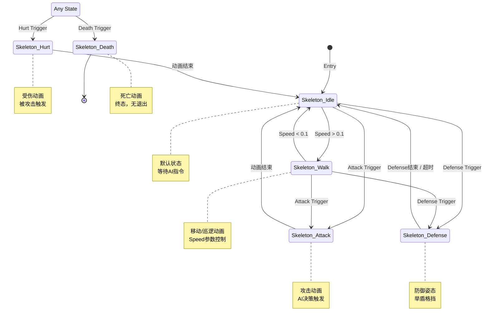

# Skeleton Animator Controller 状态机图

## Mermaid流程图



---

## 参数配置表

| 参数名 | 类型 | 默认值 | 用途 |
|--------|------|--------|------|
| Speed | Float | 0 | 控制移动动画（0=Idle, >0.1=Walk）|
| Attack | Trigger | - | 触发攻击动画 |
| Defense | Trigger | - | 触发防御姿态 |
| Death | Trigger | - | 触发死亡动画 |
| Hurt | Trigger | - | 触发受伤动画 |
| IsDefending | Bool | false | 是否处于防御状态（可选）|

---

## 状态列表

### 1. Skeleton_Idle（空闲状态）
- **位置**: (0, 100)
- **默认状态**: ✅
- **动画**: Skeleton_Idle.anim
- **转换**:
  - → Skeleton_Walk (条件: Speed > 0.1)
  - → Skeleton_Attack (条件: Attack触发)
  - → Skeleton_Defense (条件: Defense触发)

### 2. Skeleton_Walk（行走状态）
- **位置**: (340, 100)
- **动画**: Skeleton_Walk.anim
- **用途**: 巡逻、追击玩家
- **转换**:
  - → Skeleton_Idle (条件: Speed < 0.1)
  - → Skeleton_Attack (条件: Attack触发)
  - → Skeleton_Defense (条件: Defense触发)

### 3. Skeleton_Attack（攻击状态）
- **位置**: (340, -100)
- **动画**: Skeleton_Attack.anim
- **用途**: 近战攻击玩家
- **转换**:
  - → Skeleton_Idle (条件: 无，动画结束自动返回)

### 4. Skeleton_Defense（防御状态）
- **位置**: (0, -100)
- **动画**: Skeleton_Defense.anim
- **用途**: 举盾格挡，减免伤害
- **转换**:
  - → Skeleton_Idle (条件: Defense结束 或 超时)
- **特性**: 可循环播放，持续防御

### 5. Skeleton_Hurt（受伤状态）
- **位置**: (-200, 230)
- **动画**: Skeleton_Hurt.anim
- **转换**:
  - → Skeleton_Idle (条件: 无，动画结束自动返回)
- **特殊**: 从Any State触发

### 6. Skeleton_Death（死亡状态）
- **位置**: (-200, 310)
- **动画**: Skeleton_Death.anim
- **转换**: 无（终态）
- **特殊**: 从Any State触发

---

## 转换详情

### 普通转换（Normal Transitions）

#### Idle → Walk
- **条件**: Speed > 0.1
- **过渡时间**: 0.1秒
- **Exit Time**: 无
- **固定时长**: 是

#### Walk → Idle
- **条件**: Speed < 0.1
- **过渡时间**: 0.2秒
- **Exit Time**: 无
- **固定时长**: 是

#### Idle/Walk → Attack
- **条件**: Attack触发
- **过渡时间**: 0秒
- **Exit Time**: 无
- **固定时长**: 是

#### Idle/Walk → Defense
- **条件**: Defense触发
- **过渡时间**: 0.1秒
- **Exit Time**: 无
- **固定时长**: 是

#### Attack → Idle
- **条件**: 无
- **过渡时间**: 0秒
- **Exit Time**: 有（动画结束）
- **固定时长**: 是

#### Defense → Idle
- **条件**: IsDefending == false（或超时）
- **过渡时间**: 0.15秒
- **Exit Time**: 无
- **固定时长**: 是

#### Hurt → Idle
- **条件**: 无
- **过渡时间**: 0秒
- **Exit Time**: 有（动画结束）
- **固定时长**: 是

### Any State转换（Any State Transitions）

#### Any State → Death
- **条件**: Death触发
- **过渡时间**: 0秒
- **Exit Time**: 0.75
- **优先级**: 最高

#### Any State → Hurt
- **条件**: Hurt触发
- **过渡时间**: 0秒
- **Exit Time**: 0.75
- **优先级**: 高

---

## 可视化布局

```
        Any State (-460, 270)
           ├─→ Death Trigger → Skeleton_Death (-200, 310)
           └─→ Hurt Trigger → Skeleton_Hurt (-200, 230)
                                    ↓
                            Skeleton_Idle (0, 100) [Default]
                            ↙      ↓     ↘
                    Speed>0.1  Attack   Defense
                        ↓         ↓         ↓
              Skeleton_Walk  Skeleton_Attack  Skeleton_Defense
              (340,100)      (340,-100)       (0,-100)
                  ↓              ↓              ↓
              Speed<0.1      结束动画      Defense结束
                  ↓              ↓              ↓
              Skeleton_Idle ←────┴──────────────┘
```

---

## 使用说明

### 代码中设置参数

```csharp
// 获取Animator组件
Animator animator = GetComponent<Animator>();

// 设置Speed参数（Float）
animator.SetFloat("Speed", moveVector.magnitude);

// 触发攻击（Trigger）
animator.SetTrigger("Attack");

// 触发防御（Trigger）
animator.SetTrigger("Defense");

// 设置防御状态（Bool，可选）
animator.SetBool("IsDefending", true);

// 触发受伤（Trigger）
animator.SetTrigger("Hurt");

// 触发死亡（Trigger）
animator.SetTrigger("Death");
```

### 状态机工作流程

1. **敌人生成** → 进入 `Skeleton_Idle`（默认状态）

2. **巡逻/追击时**:
   - AI设置Speed > 0.1 → 切换到 `Skeleton_Walk`
   - AI设置Speed < 0.1 → 切换回 `Skeleton_Idle`

3. **攻击时**（进入攻击范围）:
   - AI触发Attack → 切换到 `Skeleton_Attack`
   - 攻击动画结束 → 自动返回 `Skeleton_Idle`

4. **防御时**（检测到玩家攻击前摇）:
   - AI触发Defense → 切换到 `Skeleton_Defense`
   - 设置IsDefending=true → 保持防御姿态
   - 设置IsDefending=false或超时 → 返回 `Skeleton_Idle`

5. **受伤时**（任何状态）:
   - 受到伤害触发Hurt → 立即切换到 `Skeleton_Hurt`
   - 受伤动画结束 → 返回 `Skeleton_Idle`

6. **死亡时**（任何状态）:
   - 生命值<=0触发Death → 立即切换到 `Skeleton_Death`
   - 保持死亡状态（无退出）

---

## AI行为逻辑建议

### 空闲状态（Idle）
```csharp
// 等待
// 扫描玩家
// 决策下一步行动（巡逻/追击）
```

### 行走状态（Walk）
```csharp
// 巡逻路径移动
// 或追击玩家
animator.SetFloat("Speed", navMeshAgent.velocity.magnitude);
```

### 攻击状态（Attack）
```csharp
// 进入攻击范围
if (distanceToPlayer < attackRange)
{
    animator.SetTrigger("Attack");
    // 在动画事件中触发伤害判定
}
```

### 防御状态（Defense）
```csharp
// 检测到玩家即将攻击
if (playerIsAttacking && Random.value < 0.5f) // 50%概率格挡
{
    animator.SetTrigger("Defense");
    animator.SetBool("IsDefending", true);
    // 减免伤害
}

// 防御持续时间结束
yield return new WaitForSeconds(defenseTime);
animator.SetBool("IsDefending", false);
```

---

## 动画文件列表

| 动画名称 | 文件路径 | 帧数建议 | 用途 |
|---------|---------|---------|------|
| Skeleton_Idle | Assets/Animation/Skeleton/Skeleton_Idle.anim | 4-6帧 | 空闲动画 |
| Skeleton_Walk | Assets/Animation/Skeleton/Skeleton_Walk.anim | 6-8帧 | 行走动画 |
| Skeleton_Attack | Assets/Animation/Skeleton/Skeleton_Attack.anim | 8-12帧 | 攻击动画 |
| Skeleton_Defense | Assets/Animation/Skeleton/Skeleton_Defense.anim | 2-4帧（循环）| 防御动画 |
| Skeleton_Hurt | Assets/Animation/Skeleton/Skeleton_Hurt.anim | 2-4帧 | 受伤动画 |
| Skeleton_Death | Assets/Animation/Skeleton/Skeleton_Death.anim | 8-12帧 | 死亡动画 |

---

## 与敌人AI状态机的对应关系

### SkeletonIdleState
```csharp
public class SkeletonIdleState : IState
{
    public void OnEnter()
    {
        animator.SetFloat("Speed", 0f);
    }
    
    public void OnUpdate()
    {
        // 扫描玩家
        // 如果发现玩家 → 切换到追击状态
    }
}
```

### SkeletonPatrolState
```csharp
public class SkeletonPatrolState : IState
{
    public void OnEnter()
    {
        // 选择巡逻点
    }
    
    public void OnUpdate()
    {
        animator.SetFloat("Speed", velocity.magnitude);
        // 移动到巡逻点
    }
}
```

### SkeletonChaseState
```csharp
public class SkeletonChaseState : IState
{
    public void OnUpdate()
    {
        animator.SetFloat("Speed", velocity.magnitude);
        
        // 如果进入攻击范围 → 切换到攻击状态
        if (distanceToPlayer < attackRange)
        {
            stateMachine.TransitionTo(attackState);
        }
    }
}
```

### SkeletonAttackState
```csharp
public class SkeletonAttackState : IState
{
    public void OnEnter()
    {
        animator.SetTrigger("Attack");
    }
    
    public void OnUpdate()
    {
        // 等待攻击动画结束
        // 攻击结束后自动返回Idle（由Animator处理）
    }
}
```

### SkeletonDefenseState
```csharp
public class SkeletonDefenseState : IState
{
    private float defenseTime = 1.5f;
    
    public void OnEnter()
    {
        animator.SetTrigger("Defense");
        animator.SetBool("IsDefending", true);
    }
    
    public void OnUpdate()
    {
        defenseTime -= Time.deltaTime;
        if (defenseTime <= 0)
        {
            animator.SetBool("IsDefending", false);
            stateMachine.TransitionTo(idleState);
        }
    }
}
```

### SkeletonHurtState
```csharp
public class SkeletonHurtState : IState
{
    public void OnEnter()
    {
        animator.SetTrigger("Hurt");
    }
    
    public void OnUpdate()
    {
        // 等待受伤动画结束（由Animator自动返回Idle）
    }
}
```

### SkeletonDeathState
```csharp
public class SkeletonDeathState : IState
{
    public void OnEnter()
    {
        animator.SetTrigger("Death");
        // 禁用碰撞、AI等组件
    }
}
```

---

## 伤害判定与动画事件

### 攻击动画事件
```csharp
// 在 Skeleton_Attack.anim 中添加 Animation Event
// 在攻击挥动的关键帧调用：

public void OnAttackHit()
{
    // 检测攻击范围内的玩家
    Collider2D[] hits = Physics2D.OverlapCircleAll(attackPoint.position, attackRadius, playerLayer);
    
    foreach (var hit in hits)
    {
        // 对玩家造成伤害
        hit.GetComponent<CharacterBase>()?.TakeDamage(attackDamage);
    }
}
```

### 防御减伤逻辑
```csharp
public override void TakeDamage(int damage)
{
    // 检查是否正在防御
    if (animator.GetBool("IsDefending"))
    {
        // 减免50%伤害
        damage = Mathf.RoundToInt(damage * 0.5f);
        // 播放格挡音效/特效
    }
    
    base.TakeDamage(damage);
}
```

---

## 与现有项目集成

### 继承 CharacterBase
```csharp
public class SkeletonController : CharacterBase
{
    private StateMachine stateMachine;
    
    protected override void Start()
    {
        base.Start();
        
        // 初始化状态机
        stateMachine = new StateMachine();
        
        var idleState = new SkeletonIdleState(this, animator, stateMachine);
        var patrolState = new SkeletonPatrolState(this, animator, stateMachine);
        var chaseState = new SkeletonChaseState(this, animator, stateMachine);
        var attackState = new SkeletonAttackState(this, animator, stateMachine);
        var defenseState = new SkeletonDefenseState(this, animator, stateMachine);
        var hurtState = new SkeletonHurtState(this, animator, stateMachine);
        var deathState = new SkeletonDeathState(this, animator, stateMachine);
        
        stateMachine.Initialize(idleState);
    }
    
    protected override void Update()
    {
        base.Update();
        stateMachine.currentState?.OnUpdate();
    }
    
    public override void Die()
    {
        animator.SetTrigger("Death");
        stateMachine.TransitionTo(deathState);
        // 禁用组件
        enabled = false;
    }
}
```

---

## 参数调优建议

### 敌人属性配置
```csharp
[Header("Skeleton属性")]
public float patrolSpeed = 2f;         // 巡逻速度
public float chaseSpeed = 4f;          // 追击速度
public float attackRange = 1.5f;       // 攻击范围
public float detectionRange = 8f;      // 检测玩家范围
public float attackCooldown = 2f;      // 攻击冷却
public float defenseProbability = 0.3f; // 防御概率（30%）
```

### 动画速度调整
```csharp
// 根据移动速度调整行走动画播放速度
animator.SetFloat("Speed", velocity.magnitude);
animatorController.speed = Mathf.Lerp(0.8f, 1.2f, velocity.magnitude / chaseSpeed);
```

---

## 注意事项

1. **防御机制**: 
   - 防御状态需要配合AI逻辑实现智能格挡
   - 可选择使用`IsDefending` Bool参数或纯Trigger+超时控制

2. **攻击判定**: 
   - 使用Animation Event在关键帧触发伤害判定
   - 避免在Update中重复判定

3. **状态优先级**: 
   - Death > Hurt > 其他状态
   - Any State转换确保受伤和死亡能打断任何动作

4. **性能优化**: 
   - 使用NavMeshAgent或简单的寻路算法
   - 限制同屏敌人数量和AI更新频率

5. **测试建议**:
   - 先测试单个状态的动画播放
   - 再测试状态转换逻辑
   - 最后集成完整的AI行为

---

## 扩展功能建议

### 1. 远程攻击变体
可以基于此状态机创建远程骷髅：
- 添加 `Skeleton_RangedAttack` 状态
- 在攻击动画中生成投射物

### 2. 特殊技能
- 添加 `Skeleton_Skill` 状态（如召唤、范围攻击）
- 使用单独的Trigger触发

### 3. 受击反馈
- 在Hurt状态添加击退效果
- 配合粒子特效和屏幕震动

### 4. 多阶段Boss
- 根据血量切换攻击模式
- 添加狂暴状态（提升动画速度）

---

*本文档为Skeleton敌人动画状态机设计方案*  
*建议配合AI行为树或有限状态机系统使用*  
*可根据实际游戏需求调整参数和逻辑*

**创建日期**: 2025年11月6日  
**版本**: 1.0
